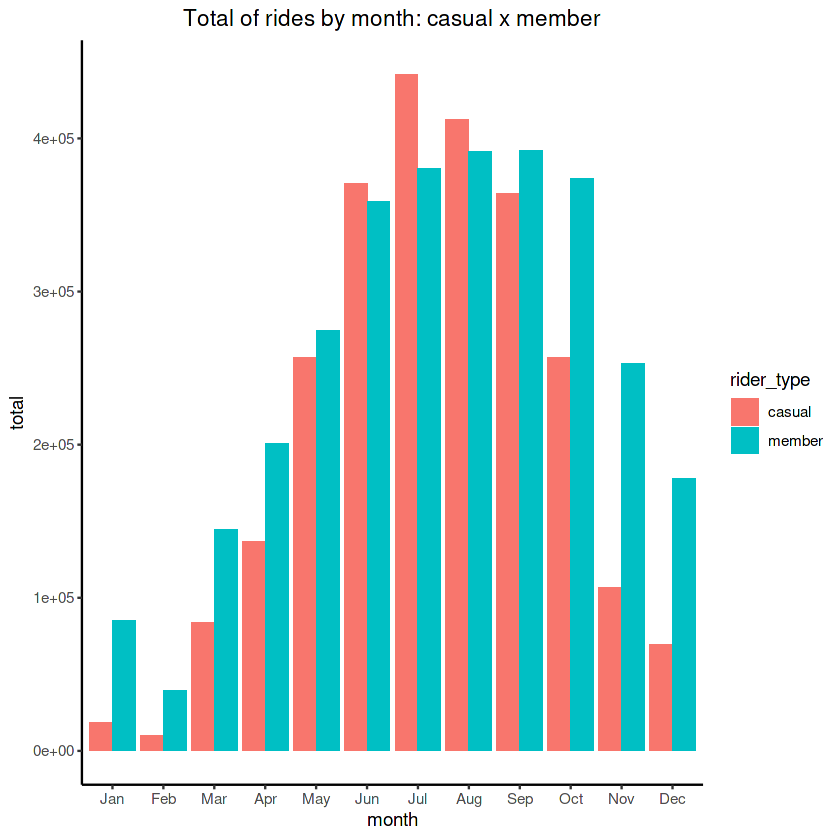

# **Case Study 01 - How Does a Bike-Share Navigate Speedy Success?**
### Google Data Analytics Professional Certificate. 
#### By [Coursera][1] 
[1]: https://www.coursera.org/professional-certificates/google-data-analytics

# **1. Introduction:**
This article is the result of the final assignment of the Google Data Analytics Course, in which I will perform real-world tasks of a junior data analyst in a fictitious company. I will follow the steps of the data analysis process: ask, prepare, process, analyze, share, and act.


# **2. Scenario:** 
I am a junior data analyst working in the marketing analyst team at Cyclistic, a bike-share company in Chicago. The director of marketing believes the company’s future success depends on maximizing the number of annual memberships. Therefore, my team wants to understand how casual riders and annual members use Cyclistic bikes differently. From these insights, the team will design a new marketing strategy to convert casual riders into annual members.


* **Business question**: How do annual members and casual riders use Cyclistic bikes differently?
* **Business task**: Analyze Cyclistic trip data from the last 12 months to identify patterns and trends 

#  **3. Prepare data:**
* For this analysis I downloaded Cyclistic’s historical trip data to analyze and identify trends
* The data is available and was collected from the website: [divvy trip data][1] 
* Period analyzed: February, 2021 – January, 2022
* The data is organized by month, in .csv files
* License: The selected data has been made available by Motivate International Inc. under this [license][2] which allows us to access, reproduce, analyze, copy, modify, distribute in this work. This analysis is distributed under the terms of the [MIT][3] license, is free and open source software
* Privacy: This work uses an anonymized database with no information identifying the users and the analyses have been done by categories of cyclists rather than individually to address privacy
* Files selected and copied:
1.	"202102-divvy-tripdata.csv"
2.	"202103-divvy-tripdata.csv"
3.	"202104-divvy-tripdata.csv"
4.	"202105-divvy-tripdata.csv"
5.	"202106-divvy-tripdata.csv"
6.	"202107-divvy-tripdata.csv"
7.	"202108-divvy-tripdata.csv"
8.	"202109-divvy-tripdata.csv"
9.	"202110-divvy-tripdata.csv"
10.	"202111-divvy-tripdata.csv"
11.	"202112-divvy-tripdata.csv"
12.	"202201-divvy-tripdata.csv"
* The credibility of the data: Data can be trusted because it's accurate, complete, and unbiased. It is a good data source to solve the business task. 
    * **Reliable** – It is from a reliable organization - DivvyBikes.
    * **Original** – It's not total original, because it's a second-party data, which is collected directly by another group. 
    * **Comprehensive** – There are all important information needed to answer the question and find the solution for the project.
    * **Current** – Data is current and relevant, from February, 21 to January,22.
    * **Cited** – In a medium level, because it's a second-party data.
 
 
* Data integrity:
Assessing the overall accuracy, consistency, and completeness of the data.
Pre-cleaning activities: check if data is sufficient; download the previous 12 months of Cyclist trips; check every single file to assure the validity of the data; merge all necessary files in a single data frame to work with a complete database; check the date formats.

[1]: https://divvy-tripdata.s3.amazonaws.com/index.html
[2]:https://ride.divvybikes.com/data-license-agreement
[3]: https://opensource.org/licenses/MIT

# **4. Process:**
1. Choose tools.
2. Check the data for errors.
3. Transform the data so I can work with it effectively.
4. Document the cleaning process.


# **4.1** Choosing tools: 
R language was chosen to process, clean, manipulate,analyze and visualize data because of the following reasons:
* a large dataset that includes 01 year of historical series of records; 
* the need to perform operations and statistical analyses.


#### Prepare R to process, transform and clean data:


```R
library(tidyverse)
library(lubridate)
library(skimr)
library(dplyr)
library(ggplot2)
library(janitor)
```

```sh
── Attaching packages ─────────────────────────────────────── tidyverse 1.3.1 ──

✔ ggplot2 3.3.5     ✔ purrr   0.3.4
✔ tibble  3.1.5     ✔ dplyr   1.0.7
✔ tidyr   1.1.4     ✔ stringr 1.4.0
✔ readr   2.0.2     ✔ forcats 0.5.1

── Conflicts ────────────────────────────────────────── tidyverse_conflicts() ──
✖ dplyr::filter() masks stats::filter()
✖ dplyr::lag()    masks stats::lag()


Attaching package: ‘lubridate’


The following objects are masked from ‘package:base’:

    date, intersect, setdiff, union


Attaching package: ‘janitor’


The following objects are masked from ‘package:stats’:

    chisq.test, fisher.test

```   
    


```R
#Upload data:
feb_21 <- read.csv("../input/cyclistic-bike-share/202102-divvy-tripdata.csv")
mar_21 <- read.csv("../input/cyclistic-bike-share/202103-divvy-tripdata.csv")
apr_21 <- read.csv("../input/cyclistic-bike-share/202104-divvy-tripdata.csv")
may_21 <- read.csv("../input/cyclistic-bike-share/202105-divvy-tripdata.csv")
jun_21 <- read.csv("../input/cyclistic-bike-share/202106-divvy-tripdata.csv")
jul_21 <- read.csv("../input/cyclistic-bike-share/202107-divvy-tripdata.csv")
aug_21 <- read.csv("../input/cyclistic-bike-share/202108-divvy-tripdata.csv")
sep_21 <- read.csv("../input/cyclistic-bike-share/202109-divvy-tripdata.csv")
oct_21 <- read.csv("../input/cyclistic-bike-share/202110-divvy-tripdata.csv")
nov_21 <- read.csv("../input/cyclistic-bike-share/202111-divvy-tripdata.csv")
dec_21 <- read.csv("../input/cyclistic-bike-share/202112-divvy-tripdata.csv")
jan_22 <- read.csv("../input/cyclistic-bike-share/202201-divvy-tripdata.csv")
```

# **4.2 Cleaning and checking for errors and inconsistences:**  

#### Check if the columns have the same names (in each file):


```R
colnames(feb_21)
colnames(mar_21)
colnames(apr_21)
colnames(may_21)
colnames(jun_21)
colnames(jul_21)
colnames(aug_21)
colnames(sep_21)
colnames(oct_21)
colnames(nov_21)
colnames(dec_21)
colnames(jan_22)
#No change necessary.
```
```sh
'ride_id''rideable_type''started_at''ended_at''start_station_name''start_station_id''end_station_name''end_station_id''start_lat''start_lng''end_lat''end_lng''member_casual'
'ride_id''rideable_type''started_at''ended_at''start_station_name''start_station_id''end_station_name''end_station_id''start_lat''start_lng''end_lat''end_lng''member_casual'
'ride_id''rideable_type''started_at''ended_at''start_station_name''start_station_id''end_station_name''end_station_id''start_lat''start_lng''end_lat''end_lng''member_casual'
'ride_id''rideable_type''started_at''ended_at''start_station_name''start_station_id''end_station_name''end_station_id''start_lat''start_lng''end_lat''end_lng''member_casual'
'ride_id''rideable_type''started_at''ended_at''start_station_name''start_station_id''end_station_name''end_station_id''start_lat''start_lng''end_lat''end_lng''member_casual'
'ride_id''rideable_type''started_at''ended_at''start_station_name''start_station_id''end_station_name''end_station_id''start_lat''start_lng''end_lat''end_lng''member_casual'
'ride_id''rideable_type''started_at''ended_at''start_station_name''start_station_id''end_station_name''end_station_id''start_lat''start_lng''end_lat''end_lng''member_casual'
'ride_id''rideable_type''started_at''ended_at''start_station_name''start_station_id''end_station_name''end_station_id''start_lat''start_lng''end_lat''end_lng''member_casual'
'ride_id''rideable_type''started_at''ended_at''start_station_name''start_station_id''end_station_name''end_station_id''start_lat''start_lng''end_lat''end_lng''member_casual'
'ride_id''rideable_type''started_at''ended_at''start_station_name''start_station_id''end_station_name''end_station_id''start_lat''start_lng''end_lat''end_lng''member_casual'
'ride_id''rideable_type''started_at''ended_at''start_station_name''start_station_id''end_station_name''end_station_id''start_lat''start_lng''end_lat''end_lng''member_casual'
'ride_id''rideable_type''started_at''ended_at''start_station_name''start_station_id''end_station_name''end_station_id''start_lat''start_lng''end_lat''end_lng''member_casual'
```

#### Check if each file has data corresponding to the filename:
``` ``` 
```R
feb_21 %>% summarize(min_day = min(started_at),max_day= max(started_at))
mar_21 %>% summarize(min_day = min(started_at),max_day= max(started_at))
apr_21 %>% summarize(min_day = min(started_at),max_day= max(started_at))
may_21 %>% summarize(min_day = min(started_at),max_day= max(started_at))
jun_21 %>% summarize(min_day = min(started_at),max_day= max(started_at))
jul_21 %>% summarize(min_day = min(started_at),max_day= max(started_at))
aug_21 %>% summarize(min_day = min(started_at),max_day= max(started_at))
sep_21 %>% summarize(min_day = min(started_at),max_day= max(started_at))
oct_21 %>% summarize(min_day = min(started_at),max_day= max(started_at))
nov_21 %>% summarize(min_day = min(started_at),max_day= max(started_at))
dec_21 %>% summarize(min_day = min(started_at),max_day= max(started_at))
jan_22 %>% summarize(min_day = min(started_at),max_day= max(started_at))
#No change necessary.
```

<table class="dataframe">
<caption>A data.frame: 1 × 2</caption>
<thead>
	<tr><th scope=col>min_day</th><th scope=col>max_day</th></tr>
	<tr><th scope=col>&lt;chr&gt;</th><th scope=col>&lt;chr&gt;</th></tr>
</thead>
<tbody>
	<tr><td>2021-02-01 00:55:44</td><td>2021-02-28 23:59:41</td></tr>
</tbody>
</table>


<table class="dataframe">
<caption>A data.frame: 1 × 2</caption>
<thead>
	<tr><th scope=col>min_day</th><th scope=col>max_day</th></tr>
	<tr><th scope=col>&lt;chr&gt;</th><th scope=col>&lt;chr&gt;</th></tr>
</thead>
<tbody>
	<tr><td>2021-03-01 00:01:09</td><td>2021-03-31 23:59:08</td></tr>
</tbody>
</table>


<table class="dataframe">
<caption>A data.frame: 1 × 2</caption>
<thead>
	<tr><th scope=col>min_day</th><th scope=col>max_day</th></tr>
	<tr><th scope=col>&lt;chr&gt;</th><th scope=col>&lt;chr&gt;</th></tr>
</thead>
<tbody>
	<tr><td>2021-04-01 00:03:18</td><td>2021-04-30 23:59:53</td></tr>
</tbody>
</table>


<table class="dataframe">
<caption>A data.frame: 1 × 2</caption>
<thead>
	<tr><th scope=col>min_day</th><th scope=col>max_day</th></tr>
	<tr><th scope=col>&lt;chr&gt;</th><th scope=col>&lt;chr&gt;</th></tr>
</thead>
<tbody>
	<tr><td>2021-05-01 00:00:11</td><td>2021-05-31 23:59:16</td></tr>
</tbody>
</table>


<table class="dataframe">
<caption>A data.frame: 1 × 2</caption>
<thead>
	<tr><th scope=col>min_day</th><th scope=col>max_day</th></tr>
	<tr><th scope=col>&lt;chr&gt;</th><th scope=col>&lt;chr&gt;</th></tr>
</thead>
<tbody>
	<tr><td>2021-06-01 00:00:38</td><td>2021-06-30 23:59:59</td></tr>
</tbody>
</table>


<table class="dataframe">
<caption>A data.frame: 1 × 2</caption>
<thead>
	<tr><th scope=col>min_day</th><th scope=col>max_day</th></tr>
	<tr><th scope=col>&lt;chr&gt;</th><th scope=col>&lt;chr&gt;</th></tr>
</thead>
<tbody>
	<tr><td>2021-07-01 00:00:22</td><td>2021-07-31 23:59:58</td></tr>
</tbody>
</table>


<table class="dataframe">
<caption>A data.frame: 1 × 2</caption>
<thead>
	<tr><th scope=col>min_day</th><th scope=col>max_day</th></tr>
	<tr><th scope=col>&lt;chr&gt;</th><th scope=col>&lt;chr&gt;</th></tr>
</thead>
<tbody>
	<tr><td>2021-08-01 00:00:04</td><td>2021-08-31 23:59:35</td></tr>
</tbody>
</table>


<table class="dataframe">
<caption>A data.frame: 1 × 2</caption>
<thead>
	<tr><th scope=col>min_day</th><th scope=col>max_day</th></tr>
	<tr><th scope=col>&lt;chr&gt;</th><th scope=col>&lt;chr&gt;</th></tr>
</thead>
<tbody>
	<tr><td>2021-09-01 00:00:06</td><td>2021-09-30 23:59:48</td></tr>
</tbody>
</table>


<table class="dataframe">
<caption>A data.frame: 1 × 2</caption>
<thead>
	<tr><th scope=col>min_day</th><th scope=col>max_day</th></tr>
	<tr><th scope=col>&lt;chr&gt;</th><th scope=col>&lt;chr&gt;</th></tr>
</thead>
<tbody>
	<tr><td>2021-10-01 00:00:09</td><td>2021-10-31 23:59:49</td></tr>
</tbody>
</table>


<table class="dataframe">
<caption>A data.frame: 1 × 2</caption>
<thead>
	<tr><th scope=col>min_day</th><th scope=col>max_day</th></tr>
	<tr><th scope=col>&lt;chr&gt;</th><th scope=col>&lt;chr&gt;</th></tr>
</thead>
<tbody>
	<tr><td>2021-11-01 00:00:14</td><td>2021-11-30 23:59:56</td></tr>
</tbody>
</table>


<table class="dataframe">
<caption>A data.frame: 1 × 2</caption>
<thead>
	<tr><th scope=col>min_day</th><th scope=col>max_day</th></tr>
	<tr><th scope=col>&lt;chr&gt;</th><th scope=col>&lt;chr&gt;</th></tr>
</thead>
<tbody>
	<tr><td>2021-12-01 00:00:01</td><td>2021-12-31 23:59:48</td></tr>
</tbody>
</table>


<table class="dataframe">
<caption>A data.frame: 1 × 2</caption>
<thead>
	<tr><th scope=col>min_day</th><th scope=col>max_day</th></tr>
	<tr><th scope=col>&lt;chr&gt;</th><th scope=col>&lt;chr&gt;</th></tr>
</thead>
<tbody>
	<tr><td>2022-01-01 00:00:05</td><td>2022-01-31 23:58:37</td></tr>
</tbody>
</table>


#### Merging all 12 files in a single Data Frame called “cyclistic_trips”:


```R
cyclistic_trips <- rbind(feb_21, mar_21, apr_21, may_21, jun_21, jul_21,
                         aug_21, sep_21, oct_21, nov_21, dec_21, jan_22)
```

#### The data frame “cyclistic_trips”, is organized by 5,601,999 rows and 13 columns:


```R
glimpse(cyclistic_trips)
```
```sh
Rows: 5,601,999
Columns: 13
$ ride_id            <chr> "89E7AA6C29227EFF", "0FEFDE2603568365", "E6159D746B…
$ rideable_type      <chr> "classic_bike", "classic_bike", "electric_bike", "c…
$ started_at         <chr> "2021-02-12 16:14:56", "2021-02-14 17:52:38", "2021…
$ ended_at           <chr> "2021-02-12 16:21:43", "2021-02-14 18:12:09", "2021…
$ start_station_name <chr> "Glenwood Ave & Touhy Ave", "Glenwood Ave & Touhy A…
$ start_station_id   <chr> "525", "525", "KA1503000012", "637", "13216", "1800…
$ end_station_name   <chr> "Sheridan Rd & Columbia Ave", "Bosworth Ave & Howar…
$ end_station_id     <chr> "660", "16806", "TA1305000029", "TA1305000034", "TA…
$ start_lat          <dbl> 42.01270, 42.01270, 41.88579, 41.89563, 41.83473, 4…
$ start_lng          <dbl> -87.66606, -87.66606, -87.63110, -87.67207, -87.625…
$ end_lat            <dbl> 42.00458, 42.01954, 41.88487, 41.90312, 41.83816, 4…
$ end_lng            <dbl> -87.66141, -87.66956, -87.62750, -87.67394, -87.645…
$ member_casual      <chr> "member", "casual", "member", "member", "member", "…
```

What does represent each column?
* ride_id - unique ride identifier code
* rideable_type  - type of bike 
* started_at – start time 
* ended_at – end time 
* start_station_name – name of the station that starts the ride 
* start_station_id - start station code 
* end_station_name - name of the station that ends the ride  
* end_station_id - end station code 
* start_lat - latitude of initial station 
* start_lng - longitude of initial station 
* end_lat - latitude of final station 
* end_lng - longitude of final station 
* member_casual – type of rider 

#### Data entry - types of riders (“member_casual” column):


```R
 unique(cyclistic_trips$member_casual)
```
```sh
'member' 'casual'
```

#### Data entry - types of (“rideable_type” column):


```R
unique(cyclistic_trips$rideable_type)
```
```sh
'classic_bike' 'electric_bike' 'docked_bike'
```

#### Checking if there are missing values:


```R
cyclistic_trips %>% filter(ride_id =="") %>% count(ride_id)
cyclistic_trips %>%  filter(rideable_type=="") %>% count(rideable_type)
cyclistic_trips %>%  filter(member_casual =="") %>% count(member_casual)
cyclistic_trips %>%  filter(started_at=="") %>% count(started_at)
cyclistic_trips %>%  filter(ended_at=="") %>% count(ended_at)
cyclistic_trips %>%  filter(start_station_name=="") %>% count(start_station_name)
cyclistic_trips %>%  filter(end_station_name =="")%>% count(end_station_name)
```


<table class="dataframe">
<caption>A data.frame: 0 × 2</caption>
<thead>
	<tr><th scope=col>ride_id</th><th scope=col>n</th></tr>
	<tr><th scope=col>&lt;chr&gt;</th><th scope=col>&lt;int&gt;</th></tr>
</thead>
<tbody>
</tbody>
</table>


<table class="dataframe">
<caption>A data.frame: 0 × 2</caption>
<thead>
	<tr><th scope=col>rideable_type</th><th scope=col>n</th></tr>
	<tr><th scope=col>&lt;chr&gt;</th><th scope=col>&lt;int&gt;</th></tr>
</thead>
<tbody>
</tbody>
</table>


<table class="dataframe">
<caption>A data.frame: 0 × 2</caption>
<thead>
	<tr><th scope=col>member_casual</th><th scope=col>n</th></tr>
	<tr><th scope=col>&lt;chr&gt;</th><th scope=col>&lt;int&gt;</th></tr>
</thead>
<tbody>
</tbody>
</table>


<table class="dataframe">
<caption>A data.frame: 0 × 2</caption>
<thead>
	<tr><th scope=col>started_at</th><th scope=col>n</th></tr>
	<tr><th scope=col>&lt;chr&gt;</th><th scope=col>&lt;int&gt;</th></tr>
</thead>
<tbody>
</tbody>
</table>


<table class="dataframe">
<caption>A data.frame: 0 × 2</caption>
<thead>
	<tr><th scope=col>ended_at</th><th scope=col>n</th></tr>
	<tr><th scope=col>&lt;chr&gt;</th><th scope=col>&lt;int&gt;</th></tr>
</thead>
<tbody>
</tbody>
</table>


<table class="dataframe">
<caption>A data.frame: 1 × 2</caption>
<thead>
	<tr><th scope=col>start_station_name</th><th scope=col>n</th></tr>
	<tr><th scope=col>&lt;chr&gt;</th><th scope=col>&lt;int&gt;</th></tr>
</thead>
<tbody>
	<tr><td></td><td>698444</td></tr>
</tbody>
</table>


<table class="dataframe">
<caption>A data.frame: 1 × 2</caption>
<thead>
	<tr><th scope=col>end_station_name</th><th scope=col>n</th></tr>
	<tr><th scope=col>&lt;chr&gt;</th><th scope=col>&lt;int&gt;</th></tr>
</thead>
<tbody>
	<tr><td></td><td>746820</td></tr>
</tbody>
</table>


##### I decided to keep those missing records from “start_station_name” and “end_station_name” columns to analyze them later.

#### Ensure that there's only characters, numbers and underscores in the column names:


```R
cyclistic_trips%>% clean_names%>% str()
```
```sh
    'data.frame':	5601999 obs. of  13 variables:
     $ ride_id           : chr  "89E7AA6C29227EFF" "0FEFDE2603568365" "E6159D746B2DBB91" "B32D3199F1C2E75B" ...
     $ rideable_type     : chr  "classic_bike" "classic_bike" "electric_bike" "classic_bike" ...
     $ started_at        : chr  "2021-02-12 16:14:56" "2021-02-14 17:52:38" "2021-02-09 19:10:18" "2021-02-02 17:49:41" ...
     $ ended_at          : chr  "2021-02-12 16:21:43" "2021-02-14 18:12:09" "2021-02-09 19:19:10" "2021-02-02 17:54:06" ...
     $ start_station_name: chr  "Glenwood Ave & Touhy Ave" "Glenwood Ave & Touhy Ave" "Clark St & Lake St" "Wood St & Chicago Ave" ...
     $ start_station_id  : chr  "525" "525" "KA1503000012" "637" ...
     $ end_station_name  : chr  "Sheridan Rd & Columbia Ave" "Bosworth Ave & Howard St" "State St & Randolph St" "Honore St & Division St" ...
     $ end_station_id    : chr  "660" "16806" "TA1305000029" "TA1305000034" ...
     $ start_lat         : num  42 42 41.9 41.9 41.8 ...
     $ start_lng         : num  -87.7 -87.7 -87.6 -87.7 -87.6 ...
     $ end_lat           : num  42 42 41.9 41.9 41.8 ...
     $ end_lng           : num  -87.7 -87.7 -87.6 -87.7 -87.6 ...
     $ member_casual     : chr  "member" "casual" "member" "member" ...   
```
#### Removing duplicate rows from the column “ride_id”: 


```R
cyclistic_trips %>% distinct(ride_id, .keep_all = TRUE)%>%nrow(.)
```
```sh
5601999
```

# **4.3 Manipulation/transformation:** 

#### Delete unnecessary columns:


```R
cyclistic_trips <-select(cyclistic_trips, -c("start_lat", "start_lng",
                                             "end_lat","end_lng"))
# check new data frame:
str(cyclistic_trips)
```
```sh
    'data.frame':	5601999 obs. of  9 variables:
     $ ride_id           : chr  "89E7AA6C29227EFF" "0FEFDE2603568365" "E6159D746B2DBB91" "B32D3199F1C2E75B" ...
     $ rideable_type     : chr  "classic_bike" "classic_bike" "electric_bike" "classic_bike" ...
     $ started_at        : chr  "2021-02-12 16:14:56" "2021-02-14 17:52:38" "2021-02-09 19:10:18" "2021-02-02 17:49:41" ...
     $ ended_at          : chr  "2021-02-12 16:21:43" "2021-02-14 18:12:09" "2021-02-09 19:19:10" "2021-02-02 17:54:06" ...
     $ start_station_name: chr  "Glenwood Ave & Touhy Ave" "Glenwood Ave & Touhy Ave" "Clark St & Lake St" "Wood St & Chicago Ave" ...
     $ start_station_id  : chr  "525" "525" "KA1503000012" "637" ...
     $ end_station_name  : chr  "Sheridan Rd & Columbia Ave" "Bosworth Ave & Howard St" "State St & Randolph St" "Honore St & Division St" ...
     $ end_station_id    : chr  "660" "16806" "TA1305000029" "TA1305000034" ...
     $ member_casual     : chr  "member" "casual" "member" "member" ...
``` 

#### Rename column member_casual to a more suitable name: rider_type


```R
cyclistic_trips <- cyclistic_trips %>% 
  rename(rider_type=member_casual)%>%
  glimpse()
```
```sh
Rows: 5,601,999
Columns: 9
$ ride_id            <chr> "89E7AA6C29227EFF", "0FEFDE2603568365", "E6159D746B…
$ rideable_type      <chr> "classic_bike", "classic_bike", "electric_bike", "c…
$ started_at         <chr> "2021-02-12 16:14:56", "2021-02-14 17:52:38", "2021…
$ ended_at           <chr> "2021-02-12 16:21:43", "2021-02-14 18:12:09", "2021…
$ start_station_name <chr> "Glenwood Ave & Touhy Ave", "Glenwood Ave & Touhy A…
$ start_station_id   <chr> "525", "525", "KA1503000012", "637", "13216", "1800…
$ end_station_name   <chr> "Sheridan Rd & Columbia Ave", "Bosworth Ave & Howar…
$ end_station_id     <chr> "660", "16806", "TA1305000029", "TA1305000034", "TA…
$ rider_type         <chr> "member", "casual", "member", "member", "member", "…
```   

#### Create a column to calculate the ride duration (in minutes): difference between “ended_at” and “started_at”


```R
cyclistic_trips$ride_duration<-difftime(cyclistic_trips$ended_at,
                                      cyclistic_trips$started_at,units="mins")
```

#### Convert data type of “ride_duration” from character to numeric:


```R
cyclistic_trips$ride_duration <- as.numeric(as.character(cyclistic_trips$ride_duration))
glimpse(cyclistic_trips)
```

```sh 
Rows: 5,601,999
Columns: 10
$ ride_id            <chr> "89E7AA6C29227EFF", "0FEFDE2603568365", "E6159D746B…
$ rideable_type      <chr> "classic_bike", "classic_bike", "electric_bike", "c…
$ started_at         <chr> "2021-02-12 16:14:56", "2021-02-14 17:52:38", "2021…
$ ended_at           <chr> "2021-02-12 16:21:43", "2021-02-14 18:12:09", "2021…
$ start_station_name <chr> "Glenwood Ave & Touhy Ave", "Glenwood Ave & Touhy A…
$ start_station_id   <chr> "525", "525", "KA1503000012", "637", "13216", "1800…
$ end_station_name   <chr> "Sheridan Rd & Columbia Ave", "Bosworth Ave & Howar…
$ end_station_id     <chr> "660", "16806", "TA1305000029", "TA1305000034", "TA…
$ rider_type         <chr> "member", "casual", "member", "member", "member", "…
$ ride_duration      <dbl> 6.7833333, 19.5166667, 8.8666667, 4.4166667, 15.233…
```     

#### Format the date column and create columns to represent the day, month, year, day of the week and hour:


```R
cyclistic_trips$date <-as.Date(cyclistic_trips $started_at) 
cyclistic_trips$year <- format(as.Date(cyclistic_trips$date), "%Y")
cyclistic_trips$month <-format(as.Date(cyclistic_trips$date),"%b")
cyclistic_trips$day <-format(as.Date(cyclistic_trips$date),"%d")
cyclistic_trips$day_of_week <- format(as.Date(cyclistic_trips$date), "%A")
cyclistic_trips$hour <- format(as.POSIXct(cyclistic_trips$started_at),"%H")
```

#### Sort data by ride duration:


```R
cyclistic_trips%>%
  arrange(ride_duration)%>%
  select(ride_id,started_at,ended_at,ride_duration) 
```


<table class="dataframe">
<caption>A data.frame: 5601999 × 4</caption>
<thead>
	<tr><th scope=col>ride_id</th><th scope=col>started_at</th><th scope=col>ended_at</th><th scope=col>ride_duration</th></tr>
	<tr><th scope=col>&lt;chr&gt;</th><th scope=col>&lt;chr&gt;</th><th scope=col>&lt;chr&gt;</th><th scope=col>&lt;dbl&gt;</th></tr>
</thead>
<tbody>
	<tr><td>7CA158F5F050156E</td><td>2021-11-07 01:58:08</td><td>2021-11-07 01:00:06</td><td>-58.03333</td></tr>
	<tr><td>FD8AF7324ABAE9DA</td><td>2021-11-07 01:56:51</td><td>2021-11-07 01:00:57</td><td>-55.90000</td></tr>
	<tr><td>508B09A5FB0737DC</td><td>2021-11-07 01:54:50</td><td>2021-11-07 01:00:45</td><td>-54.08333</td></tr>
	<tr><td>6F9E76F5EDAAC1B8</td><td>2021-11-07 01:55:42</td><td>2021-11-07 01:01:55</td><td>-53.78333</td></tr>
	<tr><td>7AECC76D1562B51C</td><td>2021-11-07 01:54:58</td><td>2021-11-07 01:01:29</td><td>-53.48333</td></tr>
	<tr><td>B506DCD44974C575</td><td>2021-11-07 01:53:34</td><td>2021-11-07 01:00:42</td><td>-52.86667</td></tr>
	<tr><td>CDB307B8494885AD</td><td>2021-11-07 01:55:09</td><td>2021-11-07 01:02:26</td><td>-52.71667</td></tr>
	<tr><td>FFD5A2DDE1FAAA90</td><td>2021-11-07 01:54:36</td><td>2021-11-07 01:03:11</td><td>-51.41667</td></tr>
	<tr><td>7E24361D78747AF6</td><td>2021-11-07 01:58:06</td><td>2021-11-07 01:06:43</td><td>-51.38333</td></tr>
	<tr><td>53222CFE6657D53D</td><td>2021-11-07 01:52:22</td><td>2021-11-07 01:01:29</td><td>-50.88333</td></tr>
	<tr><td>5AA2BC364BC7A569</td><td>2021-11-07 01:59:53</td><td>2021-11-07 01:09:02</td><td>-50.85000</td></tr>
	<tr><td>6A2DCA5CB1596CA6</td><td>2021-11-07 01:54:25</td><td>2021-11-07 01:03:44</td><td>-50.68333</td></tr>
	<tr><td>9D8C6B064E2ECEDE</td><td>2021-11-07 01:54:37</td><td>2021-11-07 01:04:33</td><td>-50.06667</td></tr>
	<tr><td>46BC473D0F68B4A2</td><td>2021-11-07 01:55:00</td><td>2021-11-07 01:05:54</td><td>-49.10000</td></tr>
	<tr><td>83B6C6B10248241E</td><td>2021-11-07 01:54:12</td><td>2021-11-07 01:05:09</td><td>-49.05000</td></tr>
	<tr><td>D6D3692804119896</td><td>2021-11-07 01:54:00</td><td>2021-11-07 01:05:08</td><td>-48.86667</td></tr>
	<tr><td>3556173EA13B5C84</td><td>2021-11-07 01:53:22</td><td>2021-11-07 01:05:08</td><td>-48.23333</td></tr>
	<tr><td>2B22D0C575CC2DF8</td><td>2021-11-07 01:53:12</td><td>2021-11-07 01:05:15</td><td>-47.95000</td></tr>
	<tr><td>08F7F73C0EC09A0B</td><td>2021-11-07 01:52:47</td><td>2021-11-07 01:05:00</td><td>-47.78333</td></tr>
	<tr><td>46D20A622D89BDCE</td><td>2021-11-07 01:52:48</td><td>2021-11-07 01:05:11</td><td>-47.61667</td></tr>
	<tr><td>82ACDD5EE3627B6C</td><td>2021-11-07 01:52:57</td><td>2021-11-07 01:05:24</td><td>-47.55000</td></tr>
	<tr><td>D631251FA9C7FC03</td><td>2021-11-07 01:52:53</td><td>2021-11-07 01:05:22</td><td>-47.51667</td></tr>
	<tr><td>49DF29FDEC7E48FB</td><td>2021-11-07 01:55:34</td><td>2021-11-07 01:08:44</td><td>-46.83333</td></tr>
	<tr><td>984A42435A4BBEB0</td><td>2021-11-07 01:49:38</td><td>2021-11-07 01:03:11</td><td>-46.45000</td></tr>
	<tr><td>E17513A83D75F889</td><td>2021-11-07 01:50:18</td><td>2021-11-07 01:03:54</td><td>-46.40000</td></tr>
	<tr><td>9BEB5FBD0EF2FCFD</td><td>2021-11-07 01:55:32</td><td>2021-11-07 01:11:50</td><td>-43.70000</td></tr>
	<tr><td>5132D82DCD66BA95</td><td>2021-11-07 01:51:21</td><td>2021-11-07 01:07:59</td><td>-43.36667</td></tr>
	<tr><td>0C29F2FD22BFE9C3</td><td>2021-11-07 01:46:06</td><td>2021-11-07 01:04:14</td><td>-41.86667</td></tr>
	<tr><td>83778DB379E8B04B</td><td>2021-11-07 01:54:08</td><td>2021-11-07 01:12:16</td><td>-41.86667</td></tr>
	<tr><td>36BCBD47831CECD3</td><td>2021-11-07 01:46:03</td><td>2021-11-07 01:04:22</td><td>-41.68333</td></tr>
	<tr><td>⋮</td><td>⋮</td><td>⋮</td><td>⋮</td></tr>
	<tr><td>60A5341F2DE39ACD</td><td>2021-07-03 21:38:05</td><td>2021-07-26 12:50:41</td><td>32592.60</td></tr>
	<tr><td>BBDA8AFFE3BB3F61</td><td>2021-09-05 14:45:30</td><td>2021-09-28 10:24:02</td><td>32858.53</td></tr>
	<tr><td>6050A356E597191B</td><td>2021-06-06 19:41:16</td><td>2021-06-29 17:28:14</td><td>32986.97</td></tr>
	<tr><td>6E3674858A48E7EB</td><td>2021-04-04 16:44:49</td><td>2021-04-28 00:37:12</td><td>33592.38</td></tr>
	<tr><td>26765E73FFA6E9D9</td><td>2021-07-18 21:30:17</td><td>2021-08-11 08:37:45</td><td>33787.47</td></tr>
	<tr><td>F08E02F53023C650</td><td>2021-06-15 18:53:02</td><td>2021-07-09 17:23:46</td><td>34470.73</td></tr>
	<tr><td>E7C8BDEB5DECC586</td><td>2021-05-14 20:24:10</td><td>2021-06-08 01:58:43</td><td>34894.55</td></tr>
	<tr><td>C8DD5E89BE2DAD7B</td><td>2021-11-06 16:53:11</td><td>2021-12-01 00:10:54</td><td>34997.72</td></tr>
	<tr><td>14DF57F4E47D031D</td><td>2021-04-04 16:44:26</td><td>2021-04-29 10:26:37</td><td>35622.18</td></tr>
	<tr><td>ED812A5D5795D403</td><td>2021-06-19 00:08:55</td><td>2021-07-13 19:46:51</td><td>35737.93</td></tr>
	<tr><td>A0DDEE247A281FD6</td><td>2021-06-13 17:46:39</td><td>2021-07-09 02:48:48</td><td>36542.15</td></tr>
	<tr><td>574CD1B5DB1E6796</td><td>2021-06-09 23:58:11</td><td>2021-07-06 16:16:47</td><td>38418.60</td></tr>
	<tr><td>94E199ACBBC27DD7</td><td>2021-07-09 17:59:03</td><td>2021-08-05 14:44:19</td><td>38685.27</td></tr>
	<tr><td>B9D638B2DC96A4F6</td><td>2021-06-01 13:17:23</td><td>2021-06-28 14:00:18</td><td>38922.92</td></tr>
	<tr><td>25DB8F5644D47B3F</td><td>2021-04-07 15:42:28</td><td>2021-05-04 17:05:33</td><td>38963.08</td></tr>
	<tr><td>FA8123589CCE9B57</td><td>2021-06-05 13:53:53</td><td>2021-07-02 23:13:02</td><td>39439.15</td></tr>
	<tr><td>C4D95269E133379D</td><td>2021-07-08 19:26:21</td><td>2021-08-05 07:13:32</td><td>39587.18</td></tr>
	<tr><td>E7FC85C69101AF97</td><td>2021-06-11 13:35:42</td><td>2021-07-09 13:36:16</td><td>40320.57</td></tr>
	<tr><td>66F0486D4849C1B9</td><td>2021-07-03 18:39:43</td><td>2021-07-31 19:00:58</td><td>40341.25</td></tr>
	<tr><td>A310C7270FD730B6</td><td>2021-10-02 18:35:36</td><td>2021-10-31 01:00:37</td><td>40705.02</td></tr>
	<tr><td>D4E35EE211346690</td><td>2021-07-10 15:59:21</td><td>2021-08-07 22:43:57</td><td>40724.60</td></tr>
	<tr><td>E25E58F5E94EE351</td><td>2021-08-01 18:53:10</td><td>2021-08-30 16:42:20</td><td>41629.17</td></tr>
	<tr><td>89F33397EABB55E7</td><td>2021-07-08 15:13:08</td><td>2021-08-06 13:18:39</td><td>41645.52</td></tr>
	<tr><td>8016DC50082D9E93</td><td>2021-06-05 21:47:40</td><td>2021-07-08 13:18:31</td><td>47010.85</td></tr>
	<tr><td>E84DF812305C9C9F</td><td>2021-04-02 17:50:00</td><td>2021-05-05 22:06:42</td><td>47776.70</td></tr>
	<tr><td>99415B003B7E7EEE</td><td>2021-07-08 19:29:49</td><td>2021-08-11 21:56:58</td><td>49107.15</td></tr>
	<tr><td>E6E1E5BFFD72ECEC</td><td>2021-06-05 23:33:51</td><td>2021-07-12 13:55:14</td><td>52701.38</td></tr>
	<tr><td>BDA1217EC8532C7B</td><td>2021-05-02 02:56:07</td><td>2021-06-08 13:37:43</td><td>53921.60</td></tr>
	<tr><td>7F0578ABF030FC83</td><td>2021-06-04 22:03:33</td><td>2021-07-13 14:15:14</td><td>55691.68</td></tr>
	<tr><td>F043F0F6A1AA4F85</td><td>2021-06-05 02:27:26</td><td>2021-07-13 22:51:35</td><td>55944.15</td></tr>
</tbody>
</table>


#### I observed that the minimum trip duration point is negative. This indicates that there are observations with inconsistent data, in which trip start date > trip end date. 
#### Since the trip duration can’t be negative, next step is to remove incorrect data entry and create a new data frame after cleaning and manipulation phases:


```R
cyclistic_trips_clean<-cyclistic_trips%>%
  filter(ended_at>started_at)
```

#### Running “summarise” function, after removing data above, the results show us that the data frame has 5.601.347 observations and no negative trip duration (minutes).


```R
cyclistic_trips_clean %>%
  summarise(minimum = min(ride_duration),nrow(.))
```


<table class="dataframe">
<caption>A data.frame: 1 × 2</caption>
<thead>
	<tr><th scope=col>minimum</th><th scope=col>nrow(.)</th></tr>
	<tr><th scope=col>&lt;dbl&gt;</th><th scope=col>&lt;int&gt;</th></tr>
</thead>
<tbody>
	<tr><td>0.01666667</td><td>5601347</td></tr>
</tbody>
</table>


# **5. Analyze:**
1. Aggregate data so it’s useful and accessible. 
2. Organize and format data. 
3. Perform calculations. 
4. Identify trends and relationships.


#### Percentage of number of trips by type of cyclist:


```R
tabyl(cyclistic_trips_clean,rider_type)
```


<table class="dataframe">
<caption>A tabyl: 2 × 3</caption>
<thead>
	<tr><th scope=col>rider_type</th><th scope=col>n</th><th scope=col>percent</th></tr>
	<tr><th scope=col>&lt;chr&gt;</th><th scope=col>&lt;dbl&gt;</th><th scope=col>&lt;dbl&gt;</th></tr>
</thead>
<tbody>
	<tr><td>casual</td><td>2529064</td><td>0.45151</td></tr>
	<tr><td>member</td><td>3072283</td><td>0.54849</td></tr>
</tbody>
</table>


##### Members represent almost 10 percentage points more in the total number of trips.

#### Total usage time by type of cyclist (minutes):


```R
cyclistic_trips_clean %>%
  group_by(rider_type) %>% 
  summarise(sum_in_min=sum(ride_duration))
```


<table class="dataframe">
<caption>A tibble: 2 × 2</caption>
<thead>
	<tr><th scope=col>rider_type</th><th scope=col>sum_in_min</th></tr>
	<tr><th scope=col>&lt;chr&gt;</th><th scope=col>&lt;dbl&gt;</th></tr>
</thead>
<tbody>
	<tr><td>casual</td><td>81029126</td></tr>
	<tr><td>member</td><td>41808232</td></tr>
</tbody>
</table>


##### The total time spent by casuals is almost double that of members.

#### Ride duration: Next step, I will check the frequency distribution of the ride durations. For better plots, a segmentation of the data was made. 
#### The first histogram is for rides shorter than 180 minutes and the second is for rides between 180 min and 1440 min (a full day).


```R
# Rides < 180 minutes:
ggplot(filter(cyclistic_trips_clean,cyclistic_trips_clean$ride_duration < 180))+
  geom_histogram(mapping = aes(x=ride_duration),bins=30)+
  scale_x_continuous(name = "ride duration (min)")+
  scale_y_continuous(name = "total of rides")+
  facet_wrap(~rider_type)
```


    

    


##### This first graphic shows us that members tend to take shorter trips than casual riders.


```R
# 180 minutes < Rides < 1440 minutes:
ggplot(filter(cyclistic_trips_clean,cyclistic_trips_clean$ride_duration > 180
              & cyclistic_trips_clean$ride_duration < 1440))+
  geom_histogram(mapping = aes(x=ride_duration),binwidth = 30)+
  scale_x_continuous(name = "ride duration (min)")+
  scale_y_continuous(name = "total of rides")+
  facet_wrap(~rider_type)
```


    

    


##### This second histogram shows that casual riders take longer trips more often than members riders. It confirms the first observation above.

#### Bicycle use: In the following, I will compare the cyclists use during the week, the months, hours and by type of bike: 


```R
# Bike use per day:
cyclistic_trips_clean %>%
  group_by(day_of_week) %>%
  filter(rider_type == "casual") %>%
  summarise(percent_rides_casual=n()/nrow(.)*100)%>%
  arrange(-percent_rides_casual)
  
cyclistic_trips_clean %>%
  group_by(day_of_week) %>%
  filter(rider_type == "member") %>%
  summarise(percent_rides_member=n()/nrow(.)*100) %>%
  arrange(-percent_rides_member)
```


<table class="dataframe">
<caption>A tibble: 7 × 2</caption>
<thead>
	<tr><th scope=col>day_of_week</th><th scope=col>percent_rides_casual</th></tr>
	<tr><th scope=col>&lt;chr&gt;</th><th scope=col>&lt;dbl&gt;</th></tr>
</thead>
<tbody>
	<tr><td>Saturday </td><td>22.05251</td></tr>
	<tr><td>Sunday   </td><td>19.00699</td></tr>
	<tr><td>Friday   </td><td>14.37907</td></tr>
	<tr><td>Monday   </td><td>11.33546</td></tr>
	<tr><td>Thursday </td><td>11.31774</td></tr>
	<tr><td>Wednesday</td><td>11.03986</td></tr>
	<tr><td>Tuesday  </td><td>10.86837</td></tr>
</tbody>
</table>


<table class="dataframe">
<caption>A tibble: 7 × 2</caption>
<thead>
	<tr><th scope=col>day_of_week</th><th scope=col>percent_rides_member</th></tr>
	<tr><th scope=col>&lt;chr&gt;</th><th scope=col>&lt;dbl&gt;</th></tr>
</thead>
<tbody>
	<tr><td>Wednesday</td><td>15.58108</td></tr>
	<tr><td>Tuesday  </td><td>15.25442</td></tr>
	<tr><td>Thursday </td><td>14.76215</td></tr>
	<tr><td>Friday   </td><td>14.48737</td></tr>
	<tr><td>Saturday </td><td>14.05059</td></tr>
	<tr><td>Monday   </td><td>13.61919</td></tr>
	<tr><td>Sunday   </td><td>12.24519</td></tr>
</tbody>
</table>


```R
# let's visualize it per day:
cyclistic_trips_clean$day_of_week <- ordered(cyclistic_trips_clean$day_of_week,
                                             levels=c("Monday", "Tuesday", "Wednesday",
                                                      "Thursday", "Friday", "Saturday",
                                                      "Sunday"))

ggplot(data = cyclistic_trips_clean,mapping = aes(x=day_of_week,fill=rider_type))+
  geom_bar(position="dodge")+
  labs(title ="Total of rides by day: casual x member",x="day of week",y="total")+
  theme_classic()+
  scale_fill_manual(values = c("casual" = "darkmagenta", "member" = "deepskyblue3"))+
  theme(plot.title = element_text(hjust = 0.5))
```


    

    


##### As you can see casual riders use bikes more on weekends, especially on Saturday, with usage starting to increase on Friday. Members use the bicycles more frequently on weekdays, and in general more regularly throughout the week.


```R
# Bike use per month:
cyclistic_trips_clean %>%
  group_by(month) %>%
  filter(rider_type == "casual") %>%
  summarise(percent_rides_casual=n()/nrow(.)*100)%>%
  arrange(-percent_rides_casual)
  
cyclistic_trips_clean %>%
  group_by(month) %>%
  filter(rider_type == "member") %>%
  summarise(percent_rides_member=n()/nrow(.)*100) %>%
  arrange(-percent_rides_member)
```


<table class="dataframe">
<caption>A tibble: 12 × 2</caption>
<thead>
	<tr><th scope=col>month</th><th scope=col>percent_rides_casual</th></tr>
	<tr><th scope=col>&lt;chr&gt;</th><th scope=col>&lt;dbl&gt;</th></tr>
</thead>
<tbody>
	<tr><td>Jul</td><td>17.4772564</td></tr>
	<tr><td>Aug</td><td>16.3146524</td></tr>
	<tr><td>Jun</td><td>14.6550661</td></tr>
	<tr><td>Sep</td><td>14.3863500</td></tr>
	<tr><td>Oct</td><td>10.1698889</td></tr>
	<tr><td>May</td><td>10.1574337</td></tr>
	<tr><td>Apr</td><td> 5.4008123</td></tr>
	<tr><td>Nov</td><td> 4.2262276</td></tr>
	<tr><td>Mar</td><td> 3.3224940</td></tr>
	<tr><td>Dec</td><td> 2.7571070</td></tr>
	<tr><td>Jan</td><td> 0.7321681</td></tr>
	<tr><td>Feb</td><td> 0.4005434</td></tr>
</tbody>
</table>


<table class="dataframe">
<caption>A tibble: 12 × 2</caption>
<thead>
	<tr><th scope=col>month</th><th scope=col>percent_rides_member</th></tr>
	<tr><th scope=col>&lt;chr&gt;</th><th scope=col>&lt;dbl&gt;</th></tr>
</thead>
<tbody>
	<tr><td>Sep</td><td>12.765751</td></tr>
	<tr><td>Aug</td><td>12.747426</td></tr>
	<tr><td>Jul</td><td>12.378970</td></tr>
	<tr><td>Oct</td><td>12.171828</td></tr>
	<tr><td>Jun</td><td>11.681639</td></tr>
	<tr><td>May</td><td> 8.940941</td></tr>
	<tr><td>Nov</td><td> 8.235179</td></tr>
	<tr><td>Apr</td><td> 6.529412</td></tr>
	<tr><td>Dec</td><td> 5.786902</td></tr>
	<tr><td>Mar</td><td> 4.701911</td></tr>
	<tr><td>Jan</td><td> 2.774744</td></tr>
	<tr><td>Feb</td><td> 1.285298</td></tr>
</tbody>
</table>


```R
# let's visualize it per month:                                  
cyclistic_trips_clean$month <- ordered(cyclistic_trips_clean$month,
                                        levels=c("Jan", "Feb", "Mar", "Apr",
                                                 "May", "Jun", "Jul", "Aug",
                                                 "Sep", "Oct", "Nov","Dec"))    

ggplot(data = cyclistic_trips_clean,mapping = aes(x=month,fill=rider_type))+
  geom_bar(position="dodge")+
  labs(title ="Total of rides by month: casual x member",x="month",y="total")+
  theme_classic()+
  theme(plot.title = element_text(hjust = 0.5))

```


    

    


##### Both casual and members ride less in January and February. Moreover,casuals have a considerable drop in usage from October. Casual cyclists use the bicycles more in the months of June, July and August. On the other hand, members use them more regularly, from June to October.


```R
# Bike use per hour:
cyclistic_trips_clean %>%
  group_by(rider_type,hour) %>% 
  summarise(numbers=n()) %>% 
  ggplot(mapping=aes(x = hour,y = numbers,group=rider_type,color=rider_type))+
  geom_line()+
  labs(title ="Total of rides by hour: casual x member",x="hour",y="total")+
  theme_classic()+
  theme(plot.title = element_text(hjust = 0.5))

```


    

    


##### The most important observation here is that both casual and members use bicycles more often between 4 pm – 6 pm, with peak consumption at 5 pm.


```R
# Per type of bike:
ggplot(data=cyclistic_trips_clean,mapping = aes(x=rideable_type,fill=rider_type))+
  geom_bar(position ="dodge",width = 0.5)+
  labs(title ="Total of rides by bike: casual x member",x ="type of bike",y ="total")+
  theme_classic()+
  scale_fill_manual(values = c("casual" = "lightblue4", "member" = "lightpink4"))+
  theme(plot.title = element_text(hjust = 0.5))

```


    

    


##### The graphic reveals that only casuals use the docked bike type in the observed period. Both casual and members prefer using classic bike rather than others.

##### **Stations use:**
##### Now let's look at the usage patterns of the stations. Since the “start_station_name” and “end_station_name” columns have missing data, as I observed in the cleaning steps, I will filter the data to avoid these empty records. Later, I will analyze them so that corrective actions can be implemented.


```R
#The 10 most used stations to start a trip:
cyclistic_trips_clean %>%
  group_by(start_station_name) %>% 
  filter(rider_type == "casual",start_station_name!="") %>% 
  summarise(number_rides_casual=n(),percent=n()/nrow(.)*100) %>% 
  arrange(-number_rides_casual,n=10) %>%
  head(n=10)

cyclistic_trips_clean %>%
  group_by(start_station_name) %>% 
  filter(rider_type == "member",start_station_name!="") %>% 
  summarise(number_rides_member=n(),percent=n()/nrow(.)*100) %>% 
  arrange(-number_rides_member,n=10) %>%
  head(n=10)
```


<table class="dataframe">
<caption>A tibble: 10 × 3</caption>
<thead>
	<tr><th scope=col>start_station_name</th><th scope=col>number_rides_casual</th><th scope=col>percent</th></tr>
	<tr><th scope=col>&lt;chr&gt;</th><th scope=col>&lt;int&gt;</th><th scope=col>&lt;dbl&gt;</th></tr>
</thead>
<tbody>
	<tr><td><span style=white-space:pre-wrap>Streeter Dr &amp; Grand Ave   </span></td><td>66388</td><td>3.0043993</td></tr>
	<tr><td>Millennium Park           </td><td>33527</td><td>1.5172696</td></tr>
	<tr><td><span style=white-space:pre-wrap>Michigan Ave &amp; Oak St     </span></td><td>29755</td><td>1.3465671</td></tr>
	<tr><td>Shedd Aquarium            </td><td>23283</td><td>1.0536758</td></tr>
	<tr><td>Theater on the Lake       </td><td>21307</td><td>0.9642516</td></tr>
	<tr><td><span style=white-space:pre-wrap>Wells St &amp; Concord Ln     </span></td><td>19882</td><td>0.8997630</td></tr>
	<tr><td>Lake Shore Dr &amp; Monroe St </td><td>19420</td><td>0.8788551</td></tr>
	<tr><td><span style=white-space:pre-wrap>Clark St &amp; Lincoln Ave    </span></td><td>16982</td><td>0.7685230</td></tr>
	<tr><td><span style=white-space:pre-wrap>Wells St &amp; Elm St         </span></td><td>16640</td><td>0.7530458</td></tr>
	<tr><td>Indiana Ave &amp; Roosevelt Rd</td><td>16594</td><td>0.7509640</td></tr>
</tbody>
</table>


<table class="dataframe">
<caption>A tibble: 10 × 3</caption>
<thead>
	<tr><th scope=col>start_station_name</th><th scope=col>number_rides_member</th><th scope=col>percent</th></tr>
	<tr><th scope=col>&lt;chr&gt;</th><th scope=col>&lt;int&gt;</th><th scope=col>&lt;dbl&gt;</th></tr>
</thead>
<tbody>
	<tr><td><span style=white-space:pre-wrap>Clark St &amp; Elm St        </span></td><td>24614</td><td>0.9139195</td></tr>
	<tr><td>Kingsbury St &amp; Kinzie St </td><td>23844</td><td>0.8853294</td></tr>
	<tr><td><span style=white-space:pre-wrap>Wells St &amp; Concord Ln    </span></td><td>23689</td><td>0.8795742</td></tr>
	<tr><td><span style=white-space:pre-wrap>Wells St &amp; Elm St        </span></td><td>20979</td><td>0.7789517</td></tr>
	<tr><td><span style=white-space:pre-wrap>Dearborn St &amp; Erie St    </span></td><td>19289</td><td>0.7162019</td></tr>
	<tr><td><span style=white-space:pre-wrap>Wells St &amp; Huron St      </span></td><td>18968</td><td>0.7042831</td></tr>
	<tr><td><span style=white-space:pre-wrap>St. Clair St &amp; Erie St   </span></td><td>18815</td><td>0.6986022</td></tr>
	<tr><td><span style=white-space:pre-wrap>Broadway &amp; Barry Ave     </span></td><td>17754</td><td>0.6592072</td></tr>
	<tr><td><span style=white-space:pre-wrap>Clinton St &amp; Madison St  </span></td><td>17119</td><td>0.6356296</td></tr>
	<tr><td>Desplaines St &amp; Kinzie St</td><td>16750</td><td>0.6219286</td></tr>
</tbody>
</table>


```R
#The 10 most used stations to finish a trip:
cyclistic_trips_clean %>%
  group_by(end_station_name) %>% 
  filter(rider_type == "casual",end_station_name!="") %>% 
  summarise(number_rides_casual=n(),percent=n()/nrow(.)*100) %>% 
  arrange(-number_rides_casual,n=10) %>%
  head(n=10)

cyclistic_trips_clean %>%
  group_by(end_station_name) %>% 
  filter(rider_type == "member",end_station_name!="") %>% 
  summarise(number_rides_member=n(),percent=n()/nrow(.)*100) %>% 
  arrange(-number_rides_member,n=10) %>%
  head(n=10)
```


<table class="dataframe">
<caption>A tibble: 10 × 3</caption>
<thead>
	<tr><th scope=col>end_station_name</th><th scope=col>number_rides_casual</th><th scope=col>percent</th></tr>
	<tr><th scope=col>&lt;chr&gt;</th><th scope=col>&lt;int&gt;</th><th scope=col>&lt;dbl&gt;</th></tr>
</thead>
<tbody>
	<tr><td><span style=white-space:pre-wrap>Streeter Dr &amp; Grand Ave   </span></td><td>68696</td><td>3.1770653</td></tr>
	<tr><td>Millennium Park           </td><td>34504</td><td>1.5957474</td></tr>
	<tr><td><span style=white-space:pre-wrap>Michigan Ave &amp; Oak St     </span></td><td>31159</td><td>1.4410472</td></tr>
	<tr><td>Theater on the Lake       </td><td>22716</td><td>1.0505738</td></tr>
	<tr><td>Shedd Aquarium            </td><td>21607</td><td>0.9992845</td></tr>
	<tr><td><span style=white-space:pre-wrap>Wells St &amp; Concord Ln     </span></td><td>19430</td><td>0.8986022</td></tr>
	<tr><td>Lake Shore Dr &amp; Monroe St </td><td>18103</td><td>0.8372309</td></tr>
	<tr><td>Lake Shore Dr &amp; North Blvd</td><td>17369</td><td>0.8032847</td></tr>
	<tr><td><span style=white-space:pre-wrap>Clark St &amp; Lincoln Ave    </span></td><td>17138</td><td>0.7926014</td></tr>
	<tr><td><span style=white-space:pre-wrap>Wabash Ave &amp; Grand Ave    </span></td><td>17088</td><td>0.7902890</td></tr>
</tbody>
</table>


<table class="dataframe">
<caption>A tibble: 10 × 3</caption>
<thead>
	<tr><th scope=col>end_station_name</th><th scope=col>number_rides_member</th><th scope=col>percent</th></tr>
	<tr><th scope=col>&lt;chr&gt;</th><th scope=col>&lt;int&gt;</th><th scope=col>&lt;dbl&gt;</th></tr>
</thead>
<tbody>
	<tr><td><span style=white-space:pre-wrap>Clark St &amp; Elm St       </span></td><td>24775</td><td>0.9200720</td></tr>
	<tr><td><span style=white-space:pre-wrap>Wells St &amp; Concord Ln   </span></td><td>24352</td><td>0.9043630</td></tr>
	<tr><td>Kingsbury St &amp; Kinzie St</td><td>23836</td><td>0.8852003</td></tr>
	<tr><td><span style=white-space:pre-wrap>Wells St &amp; Elm St       </span></td><td>21653</td><td>0.8041299</td></tr>
	<tr><td><span style=white-space:pre-wrap>Dearborn St &amp; Erie St   </span></td><td>19941</td><td>0.7405512</td></tr>
	<tr><td><span style=white-space:pre-wrap>St. Clair St &amp; Erie St  </span></td><td>18815</td><td>0.6987348</td></tr>
	<tr><td><span style=white-space:pre-wrap>Wells St &amp; Huron St     </span></td><td>18733</td><td>0.6956896</td></tr>
	<tr><td><span style=white-space:pre-wrap>Broadway &amp; Barry Ave    </span></td><td>18496</td><td>0.6868881</td></tr>
	<tr><td>Clinton St &amp; Madison St </td><td>17572</td><td>0.6525734</td></tr>
	<tr><td><span style=white-space:pre-wrap>Green St &amp; Madison St   </span></td><td>17057</td><td>0.6334478</td></tr>
</tbody>
</table>


##### The start and end stations are different between the two types of cyclists. But it’s interesting to see that the number 1 station chosen by casuals for both starting and ending the ride has 49.5% higher use than the second most used station. 

#### Missing data from stations: Below, I’m going to check the records that do not have the station names, by type of cyclist and type of bicycle:


```R
#start station:
cyclistic_trips_clean %>% 
  filter(start_station_name =="") %>% 
  summarise(missing_start_name = n())

#end station:
cyclistic_trips_clean %>% 
  filter(end_station_name =="") %>% 
  summarise(missing_end_name = n())
```


<table class="dataframe">
<caption>A data.frame: 1 × 1</caption>
<thead>
	<tr><th scope=col>missing_start_name</th></tr>
	<tr><th scope=col>&lt;int&gt;</th></tr>
</thead>
<tbody>
	<tr><td>698419</td></tr>
</tbody>
</table>


<table class="dataframe">
<caption>A data.frame: 1 × 1</caption>
<thead>
	<tr><th scope=col>missing_end_name</th></tr>
	<tr><th scope=col>&lt;int&gt;</th></tr>
</thead>
<tbody>
	<tr><td>746376</td></tr>
</tbody>
</table>


```R
#by bicycle type - from initial stations: 
ggplot(filter(cyclistic_trips_clean, cyclistic_trips_clean$start_station_name ==""))+
  geom_bar(mapping = aes(x = rideable_type),width = 0.3)+
  labs(title ="Missing data from initial stations",x ="type of bike",y ="total")+
  facet_wrap(~rider_type)+
  theme(plot.title = element_text(hjust = 0.5))
```


    

    


```R
#by bicycle type - from final stations: 
ggplot(filter(cyclistic_trips_clean, cyclistic_trips_clean$end_station_name ==""))+
    geom_bar(mapping = aes(x = rideable_type),width = 0.3)+
    labs(title = "Missing data from final stations",x ="type of bike",y="total")+
    facet_wrap(~rider_type)+
    theme(plot.title = element_text(hjust = 0.5))
```


    

    


##### From these graphics, you can see that those inconsistent records in start and end station name occurs predominantly with electric bikes.


#### Average ride time: Next, let’s analyze the mode, average trip duration, standard deviation and median for each cyclist:


```R
# mode or modal value for casual:

#create a function:
find_mode <- function(x) {
  u <- unique(x)
  tab <- tabulate(match(x, u))
  u[tab == max(tab)]
}

data_casual <- cyclistic_trips_clean %>%
  select(ride_duration,rider_type) %>% 
  filter(rider_type =="casual")

find_mode(data_casual$ride_duration)

```

```sh
8.23333333333333
```

##### The most frequent trip duration among casuals: about 8 minutes


```R
# mode or modal value for member:
data_member <- cyclistic_trips_clean %>%
  select(ride_duration,rider_type) %>% 
  filter(rider_type =="member")

find_mode(data_member$ride_duration)
```

```sh
4.83333333333333
```

##### The most frequent trip duration among members: almost 5 minutes


```R
# average trip duration, median and standard deviation:
cyclistic_trips_clean %>%
group_by(rider_type) %>% 
summarise(average_in_min = mean(ride_duration),
          stand_deviation = sd(ride_duration),
          median = median(ride_duration))
```


<table class="dataframe">
<caption>A tibble: 2 × 4</caption>
<thead>
	<tr><th scope=col>rider_type</th><th scope=col>average_in_min</th><th scope=col>stand_deviation</th><th scope=col>median</th></tr>
	<tr><th scope=col>&lt;chr&gt;</th><th scope=col>&lt;dbl&gt;</th><th scope=col>&lt;dbl&gt;</th><th scope=col>&lt;dbl&gt;</th></tr>
</thead>
<tbody>
	<tr><td>casual</td><td>32.03918</td><td>265.04731</td><td>15.950000</td></tr>
	<tr><td>member</td><td>13.60820</td><td> 28.04648</td><td> 9.566667</td></tr>
</tbody>
</table>


#### Let’s see what the column graph looks like comparing average duration per day and per cyclist, including the standard deviation above and below the average.


```R
cyclistic_trips_clean %>%
  group_by(rider_type,day_of_week) %>% 
  summarise(average_trip = mean(ride_duration), std_dev = sd(ride_duration)) %>% 
  ggplot(mapping = aes(x = day_of_week,y = average_trip,fill = rider_type))+
  geom_errorbar(aes(ymin = average_trip-std_dev,ymax = average_trip+std_dev),size=1,
                position = position_dodge(0.9),width=0.25)+
  geom_col(position = "dodge")+
  labs(title ="Average trip by day: casual x member",
       x = "day", y = "average trip duration (min)")+
  theme_classic()+
  theme(plot.title = element_text(hjust = 0.5))+
  scale_fill_viridis_d()
```


    

    


##### As you can see from the table the average trip duration for casuals is 32 ± 265 minutes, while for members it is 13.6 ± 28 minutes. Since the standard deviation is higher than the averages, it is not possible to conduct comparative analysis of the averages trip duration. But it is possible to observe that the standard deviation of casual is around 9.5 times on average from the one of the members. This means that the time variance of the casual is nearly 90 times the member’s. 


# **6. Conclusions – Important findings:** 

* Members represent almost 10 percentage points more in total numbers of trips than casuals. But the total usage time for casuals is almost twice than for members.

* Casual riders take longer trips more often than members riders.

* Casuals use bikes more on weekends, with 22.1% on Saturday and 19% on Sunday, with usage starting to increase on Friday. Members use the bicycles more frequently and regularly during the week.

* Casual cyclists use the bicycles more in the months of July and August. On the other hand, members use them more regularly, from June to October.

* Both casual and members ride less in January and February. Moreover, casuals have a considerable drop in usage from October.

* Only casuals use the docked bike type in the observed period. Both casual and members prefer using classic bike rather than others.

* The number 1 station chosen by casuals for both starting and ending the ride (Streeter Dr & Grand Ave) has 49.5% higher use than the second most used station.

* Average trip duration for casuals is 32 ± 265 minutes, while for members it is 13.6 ± 28 minutes. The time variance of the casual is nearly 90 times the member’s. 

* There are missing start and end station name records, that occurs predominantly with electric bikes. This means it is important to evaluate company systems and infrastructure to fix this issue. 


# **7. Recommendations:**
Based on the results of the data analysis, I suggest the following actions to the executives in order to design a new marketing strategy to convert casual riders into annual members:

1. Offer special discounts for family and friends of members on weekends.

2. Provide special mileage or points programs for use at partner stores on weekends.

3. Offer subscriptions for rides only on weekends.

4. Launch discount campaigns in the summer season - from June to August.

5. Share promotional advertisements for annual subscription plans in the stations most used by casuals, especially the first three: Streeter Dr & Grand Ave, Millennium Park, Michigan Ave & Oak St.

